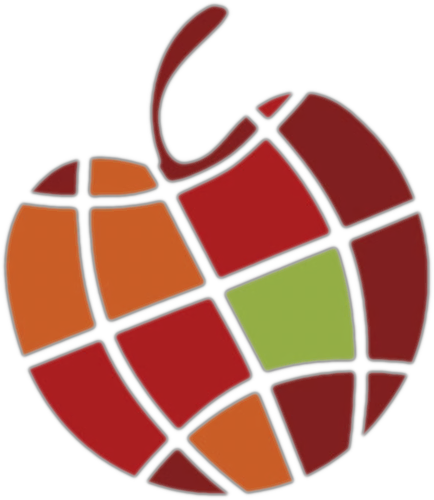

# Vecka 1

Introduktion till ämnet.

## Vad vi inte kommer att förstå

* Hacka sig in på ett Facebook konto.
* Visa dig hur man använder kopiatorn.
* Bli nästa Jeff Bezos.
----
* Avancerad programmering.
* Teoretiska bakgrunder.
* Historia & bakgrundsämnen.

## Vad vi kommer att förstå

* **HTML**
```html
<!DOCTYPE html>
<html lang="en">

<head>
  <title>Dokument</title>
</head>

<body>
  <p class="paragraf">Hej!</p>
</body>

</html>
```
* **CSS**
```css
/* `html` är dokumentets "rot/grund" element. */
html {
  background-color: black;
}

/* Refererar till ` class="paragraf" ` */
.paragraf {
  color: limegreen;
  font-family: Monospace;
  font-size: 2rem;
}
```
* **JavaScript**
```js
// Hitta alla element med ` class="paragraph" `.
const paragrafer = document.querySelectorAll('.paragraf')

// Gå igenom alla hittade element.
for (let index = 0; index < paragrafer.length; index++) {
  const paragraf = paragrafer[index]

  // 'onclick' händer när vi trycker på ett paragraf element.
  paragraf.onclick = function click (event) {
    event.preventDefault()

    // ` alert() ` används när man vill visa en "popup" ruta med text.
    alert(this.innerText)
  }
}
```
Vad betyder det i klarspråk?

Förstå vad en webbsidas beståndsdelar är.

## Vad vi ska göra

* Skapa en hemsida med hjälp av CSS, HTML & JavaScript.
* Om vi hinner, kanske påbörja ett litet spelprojekt?

## Varför gör vi X på Y sätt

* För konsistensens skull.
* För att skapa något som fungerar.
* **Har inte tillräckligt med tid för att visa alternativa utföranden.**

## Förväntningar

* Vara på plats.
* **Fråga om hjälp.**
* Be om att förtydliga saker man inte förstår.
* **Hjälpa varandra.**

Och sist men inte minst, **lära oss något nytt**_-igt?_

---

**Karar Al-Remahy**
<br> Marieborg | Tema Internationellt - Utsikten
