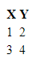

# HTML

[Ytterligare HTML information från MDN](https://developer.mozilla.org/en-US/docs/Web/HTML).

## DOM Tree

Ett DOM träd, används inte bara för HTML.

<hr>

## Viktiga element

### Paragraf - `<p>`

```html
<p></p>
```

Ett paragraf element. Används för indelning av ett nytt text stycke, den lägger en visuell radavstånd från andra element på sidan. Du kan inte ha en paragraf i en paragraf, men om du vill lägga till ett radavstånd kan du använda dig av

[Mer information här.](https://developer.mozilla.org/en-US/docs/Web/HTML/Element/p)

### Bryt linje - `<br>`

```html
<br>
```

som betyder "break line". Alltså bryt linje.

[Mer information här.](https://developer.mozilla.org/en-US/docs/Web/HTML/Element/br)

### Bild - ``

```html

```

Ett bild element. Används för att lägga till en bild i dokumentet. Inom "src"s citattecken ska du ha en länk, en hypertext, som tar dig till bilden.

[Mer information här.](https://developer.mozilla.org/en-US/docs/Web/HTML/Element/img)

### Fetstil - `<b>, <strong>`

```html
<b>
  Bold.
</b>
<strong>
  Strong.
</strong>
```

Ett fetstil element. Fetstil markerar text. Både `<b>` och `<strong>` används till samma syfte.

[Mer information här för `<b>`](https://developer.mozilla.org/en-US/docs/Web/HTML/Element/b) och [mer information här för `<strong>`.](https://developer.mozilla.org/en-US/docs/Web/HTML/Element/strong)

### Kursiv stil - `<i>`, `<cite>`

```html
<i>
  Italic text.
</i>
<cite>
  En citering.
</cite>
```

Ett kursiv stil element. Högerlutande bokstavsform. `<i>` kan användas för olika idiomatiska syften men `<cite>` bör användas när man citerar någon eller något men båda vanligtvis används för att böja på text.

[Mer information här för `<i>`](https://developer.mozilla.org/en-US/docs/Web/HTML/Element/i) och [mer information här för `<cite>`.](https://developer.mozilla.org/en-US/docs/Web/HTML/Element/cite)

### Markera - `<mark>`

```html
<mark>
  Markerar mig med en gul bakgrund.
</mark>
```

Ett markerings element. Markerar texten med en gul bakgrund. Används för referens, eller noterings syften.

[Mer information här.](https://developer.mozilla.org/en-US/docs/Web/HTML/Element/mark)

### Citering - `<q>`

```html
<q>
  Runt detta stycke kommer citat-tecken att dyka upp.
</q>
```

Ett citerings element. Texten får citattecken på början och på slutet. Används för citat.

[Mer information här.](https://developer.mozilla.org/en-US/docs/Web/HTML/Element/q)

### Utökad citering - `<blockquote>`

```html
<blockquote cite="https://www.huxley.net/bnw/four.html">
  <p>Words can be like X-rays, if you use them properly—they’ll go through anything. You read and you’re pierced.</p>
  <p>-- Aldous Huxley, <cite>Brave New World</cite></p>
</blockquote>
```

[Mer information här.](https://developer.mozilla.org/en-US/docs/Web/HTML/Element/blockquote)

### Tabell - `<table>, <thead>, <tbody>, <tr>, <th>, <td>`

```html
<table>
  <thead>
    <tr>
      <th></th>
    </tr>
  </thead>
  <tbody>
    <tr>
      <td></td>
    </tr>
  </tbody>
</table>
```

Ett tabell element. Används för att bygga upp tabeller. THEAD är topp raden, och definerar hur många kolumner det ska finnas.
I THEAD finns en rad, alltså TR. Och inuti TR finns ett huvud, alltså TH. Lägg till flera TH för att definera hur många kolumner varje TR i TBODY skall ha.

**Exempel:**

```html
<table>
  <thead>
    <tr>
      <th>X</th>
      <th>Y</th>
    </tr>
  </thead>
  <tbody>
    <tr>
      <td>1</td>
      <td>2</td>
    </tr>
    <tr>
      <td>3</td>
      <td>4</td>
    </tr>
  </tbody>
</table>
```

som blir till:



[Mer information här.](https://developer.mozilla.org/en-US/docs/Web/HTML/Element/table)
